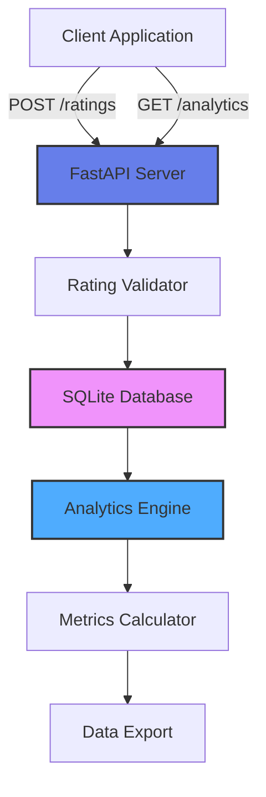

# ⭐ Conversation Quality Rating & Analytics System

[](https://www.python.org/)
[](https://fastapi.tiangolo.com/)
[](LICENSE)

A production-grade backend API for collecting, storing, and analyzing conversation quality ratings. Designed for contact centers, chatbots, and AI systems that need to track interaction quality and user satisfaction.

## 🎯 Project Overview

This system demonstrates data engineering and backend development skills essential for ML operations and quality monitoring in production systems - similar to feedback systems used by Amazon Connect, chatbot platforms, and customer service applications.

**Key Use Cases:**
- Customer service call quality ratings
- Chatbot/AI conversation feedback
- Agent performance tracking
- Model quality monitoring
- Training data collection for RLHF (Reinforcement Learning from Human Feedback)

## ✨ Features

### Rating Collection
- **1-5 Star Ratings**: Industry-standard rating scale
- **Text Feedback**: Optional user comments
- **Metadata Capture**: Conversation ID, user ID, timestamp, session info
- **Bulk Import**: Load historical ratings via CSV/JSON

### Analytics Engine
- **Rating Distribution**: See breakdown of ratings (1-5 stars)
- **Average Score Calculation**: Overall quality metrics
- **Trend Analysis**: Track ratings over time
- **Sentiment Analysis**: Categorize feedback as positive/neutral/negative
- **Comparison Metrics**: Compare different time periods or conversation types

### Data Management
- **RESTful API**: Easy integration with any frontend
- **SQLite Storage**: Persistent data storage
- **Data Export**: Export to CSV/JSON for analysis
- **Query Filtering**: Filter by date, rating, conversation type

### Observability
- **Request Logging**: Track all API calls
- **Performance Metrics**: Response times and throughput
- **Data Validation**: Ensure rating integrity

## 🏗️ Architecture


🛠️ Tech Stack

Framework: FastAPI (async Python web framework)
Database: SQLite (easily upgradeable to PostgreSQL)
Validation: Pydantic models
API Documentation: Automatic OpenAPI/Swagger docs
Analytics: Pandas for data analysis

📦 Installation
Prerequisites

Python 3.8 or higher
pip

Setup

1. Clone the repository
git clone https://github.com/yourusername/conversation-rating-system.git
cd conversation-rating-system

2. Install dependencies
pip install -r requirements.txt

3. Run the server
python app.py

4. Access the API
API: http://localhost:8000
Interactive docs: http://localhost:8000/docs
Alternative docs: http://localhost:8000/redoc

## 🚀 Usage

### Submit a Rating
```bash
curl -X POST "http://localhost:8000/ratings" \
  -H "Content-Type: application/json" \
  -d '{
    "conversation_id": "conv_12345",
    "rating": 5,
    "feedback": "Excellent support, very helpful!",
    "user_id": "user_789",
    "metadata": {
      "agent_id": "agent_001",
      "duration_seconds": 180,
      "category": "technical_support"
    }
  }'
```

### Get Analytics
```
# Overall statistics
curl "http://localhost:8000/analytics/summary"

# Rating distribution
curl "http://localhost:8000/analytics/distribution"

# Time-based trends
curl "http://localhost:8000/analytics/trends?days=7"

# Filter by rating
curl "http://localhost:8000/ratings?min_rating=4"
```

## 💿 Export Data
```
# Export as JSON
curl "http://localhost:8000/export?format=json" -o ratings.json

# Export as CSV
curl "http://localhost:8000/export?format=csv" -o ratings.csv
```

## 📊 API Endpoints

### Rating Operations

| Method | Endpoint | Description |
|--------|----------|-------------|
| POST | `/ratings` | Submit a new rating |
| GET | `/ratings` | Get all ratings (with filters) |
| GET | `/ratings/{id}` | Get specific rating |
| DELETE | `/ratings/{id}` | Delete a rating |

### Analytics

| Method | Endpoint | Description |
|--------|----------|-------------|
| GET | `/analytics/summary` | Overall statistics |
| GET | `/analytics/distribution` | Rating breakdown |
| GET | `/analytics/trends` | Time-based trends |
| GET | `/analytics/sentiment` | Sentiment analysis |

### Data Export

| Method | Endpoint | Description |
|--------|----------|-------------|
| GET | `/export` | Export data (JSON/CSV) |
| POST | `/import` | Bulk import ratings |


📋 Example Response
```
POST /ratings
{
  "id": 1,
  "conversation_id": "conv_12345",
  "rating": 5,
  "feedback": "Excellent support, very helpful!",
  "user_id": "user_789",
  "timestamp": "2025-01-05T10:30:00",
  "metadata": {
    "agent_id": "agent_001",
    "duration_seconds": 180,
    "category": "technical_support"
  },
  "sentiment": "positive"
}

GET /analytics/summary
{
  "total_ratings": 1547,
  "average_rating": 4.2,
  "rating_distribution": {
    "1": 45,
    "2": 89,
    "3": 234,
    "4": 567,
    "5": 612
  },
  "sentiment_breakdown": {
    "positive": 1179,
    "neutral": 234,
    "negative": 134
  },
  "time_period": "all_time"
}
```

📁 Project Structure
```
conversation-rating-system/
├── app.py                  # Main FastAPI application
├── models.py               # Pydantic data models
├── database.py             # Database operations
├── analytics.py            # Analytics calculations
├── requirements.txt        # Python dependencies
├── ratings.db             # SQLite database (auto-created)
├── README.md              # This file
└── LICENSE                # MIT License
```

🎓 Skills Demonstrated
```
Backend Development
✅ RESTful API Design: Industry-standard REST endpoints
✅ Data Validation: Pydantic models with type checking
✅ Database Operations: CRUD operations with SQLite
✅ Async Programming: FastAPI async/await patterns

Data Engineering
✅ Data Collection: Structured rating and feedback capture
✅ Data Storage: Persistent storage with indexing
✅ Data Export: Multiple format support (JSON, CSV)
✅ Analytics: Aggregations and statistical calculations

MLOps-Related
✅ Feedback Collection: RLHF data collection pipeline
✅ Quality Metrics: Track model/system performance
✅ Data Labeling: Human feedback for training
✅ Metadata Tracking: Context for ML training

Software Engineering
✅ Clean Code: Modular, maintainable design
✅ API Documentation: Auto-generated Swagger docs
✅ Error Handling: Comprehensive validation
✅ Testing-Ready: Structured for unit tests
```

🔍 Technical Highlights
```
Data Model Design

class RatingCreate(BaseModel):
    conversation_id: str
    rating: int = Field(ge=1, le=5)  # 1-5 only
    feedback: Optional[str] = None
    user_id: Optional[str] = None
    metadata: Optional[Dict] = {}

  
Analytics Calculations

def calculate_statistics(ratings):
    """
    Calculate comprehensive rating statistics
    - Average rating
    - Distribution across 1-5 stars
    - Sentiment classification
    - Trend analysis
    """
  
Sentiment Analysis

def analyze_sentiment(rating, feedback):
    """
    Simple rule-based sentiment:
    - 4-5 stars = positive
    - 3 stars = neutral
    - 1-2 stars = negative
    Can be upgraded to ML-based sentiment
    """
```


🧪 Testing
```
Manual Testing with Swagger UI

Start the server: python app.py
Open browser: http://localhost:8000/docs
Try the interactive API documentation
Submit test ratings and view analytics
```

Sample Test Data
```
# Create sample ratings
python -c "
import requests

test_ratings = [
    {'conversation_id': 'conv_001', 'rating': 5, 'feedback': 'Great!'},
    {'conversation_id': 'conv_002', 'rating': 4, 'feedback': 'Good service'},
    {'conversation_id': 'conv_003', 'rating': 3, 'feedback': 'Average'},
    {'conversation_id': 'conv_004', 'rating': 2, 'feedback': 'Not satisfied'},
    {'conversation_id': 'conv_005', 'rating': 1, 'feedback': 'Poor experience'}
]

for rating in test_ratings:
    requests.post('http://localhost:8000/ratings', json=rating)
"
```


## Use Cases
1. Contact Center Quality Monitoring
Track agent performance and customer satisfaction in real-time.
2. Chatbot/AI Feedback Loop
Collect user feedback on AI responses to improve model quality.
3. RLHF Data Collection
Gather preference data for reinforcement learning from human feedback.
4. Product Feedback System
Rate features, support interactions, or product experiences.
5. A/B Testing
Compare ratings between different conversation strategies or models.

## 🚀 Future Enhancements
1. PostgreSQL support for production scale
2. Authentication and authorization (JWT)
3. Real-time dashboard with WebSocket updates
4. Advanced ML-based sentiment analysis
5. Comparative analysis (model A vs model B)
6. Integration with Prometheus for metrics
7. Slack/email notifications for low ratings
8. Multi-language feedback support

📝 License
MIT License - see LICENSE file
👤 Author
Sanik Patige

GitHub: @sanikpatige


